## Real-time Gene Flow

&nbsp;

<span class="footnote">Smouse <i>et al.</i> (2001). <i>Evolution</i>, <b>55</b>, 260-271.<br/>Dyer <i>et al.</i> (2004) <i>Heredity</i>, <b>92</b>, 204-211.</span>

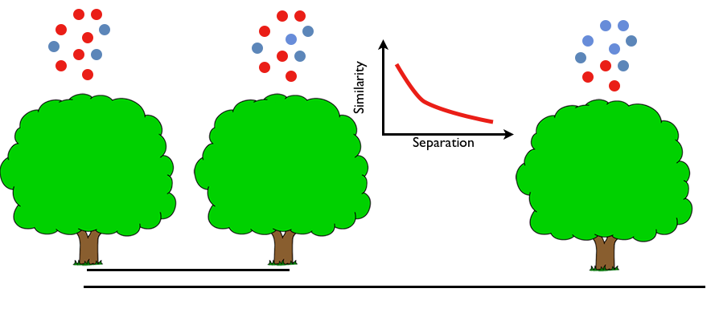

*** =pnotes

LIT Genetic structure in network, what about env?


--- &twocol bg:white

## Ecological Resistance

*** =left

### Shortest Path Distance

<center>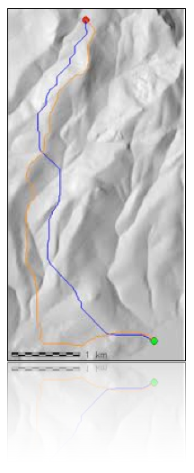</center>


*** =right

### Circuit Distance

<center>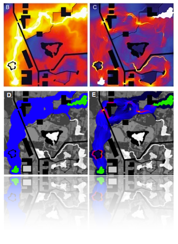</center>

*** =pnotes

SP: Ecological surface, Not symmetric, may not optimize
RL: All paths, network flow, many routes


--- &twocol bg:white

## <i>Cornus florida</i> L.


*** =left

&nbsp;
- Endemic understory tree
&nbsp;
- Insect pollinated
&nbsp;
- Animal dispersed seeds
&nbsp;
- Early season phenology

*** =right

<center></center>


--- bg:white

## Study Site

<center>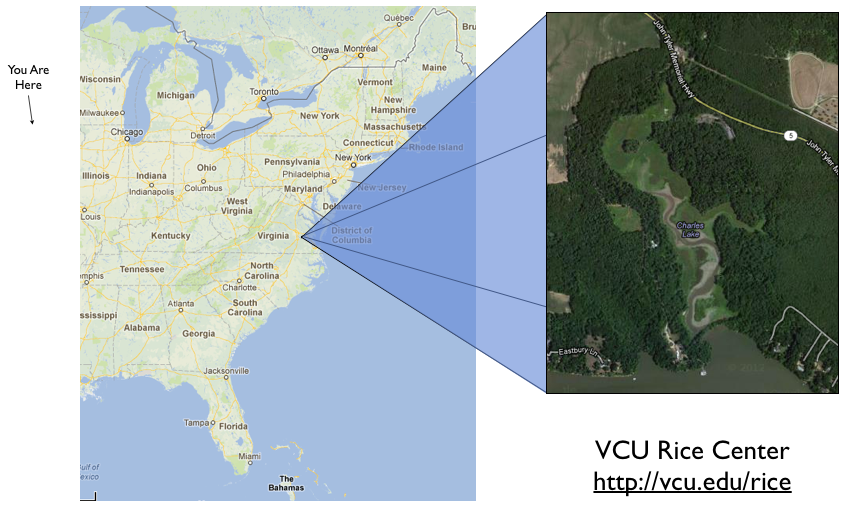</center>


---  bg:white

## Pollen Connectivity

<center>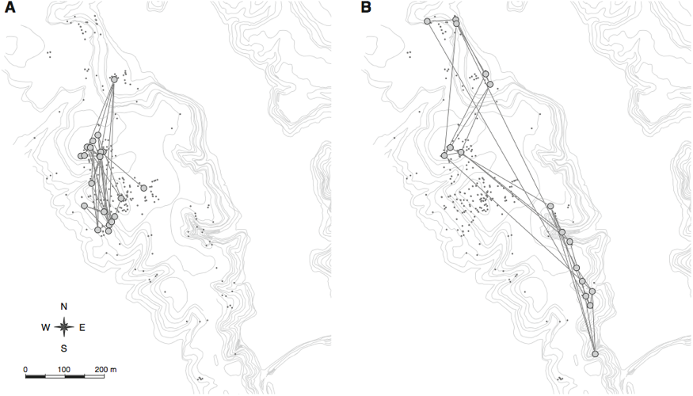</center>

<span class="footnote">Dyer <i>et al.</i> (2013) <i>Landscape Ecology</i>, <b>27</b>, 239-251</span>

--- bg:white

## Landscape Features Influencing Connectivity

&nbsp;

<span class="footnote">Dyer <i>et al.</i> (2013) <i>Landscape Ecology</i>, <b>27</b>, 239-251</span>

<center>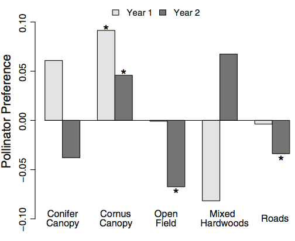</center>


--- bg:white

<center>
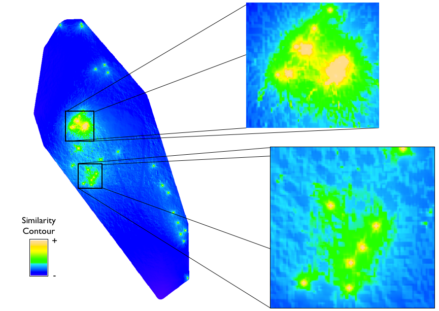
</center>


<!--- 
#####################################################################
#                     Adaptive Example
#####################################################################
-->


--- &center_title .green

# Adaptive Genetic Structure

## The part most people think of


*** =pnotes
1. Fundamental interest to biologists
  - understand functionality and interaction with ecology


--- .nobrackground 
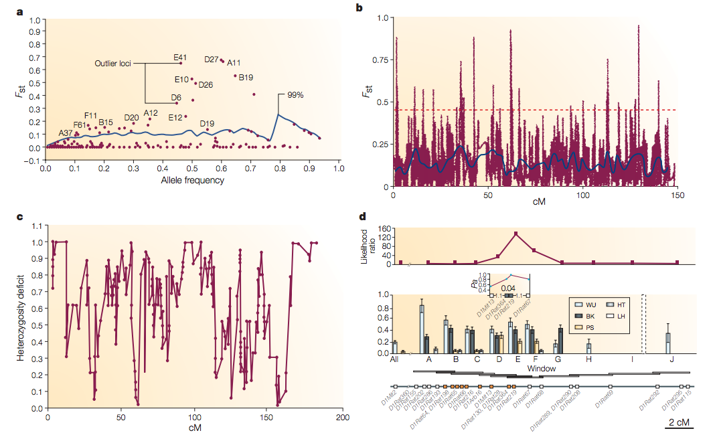


*** =pnotes
1. Luikart et al. 2003
2. Fst outliers (AFLP & SNP), Heterozygosity (sweeps), Linkage


---   bg:white
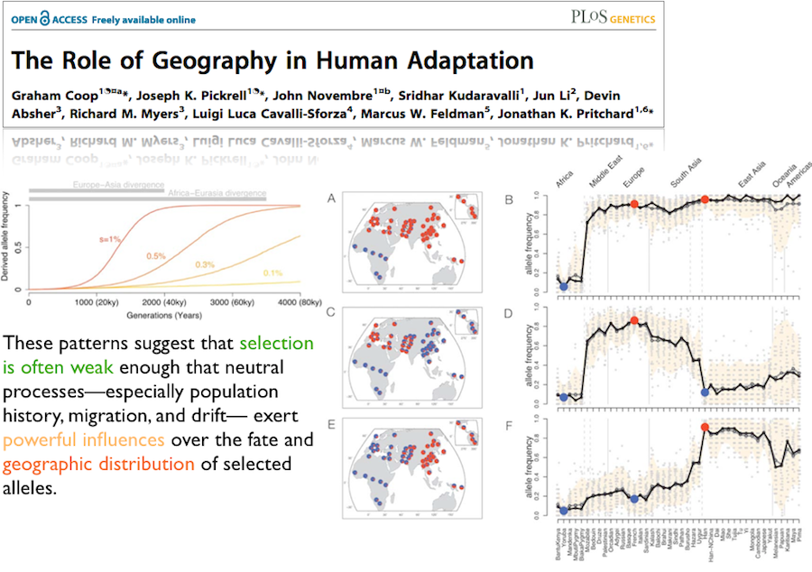


--- &twocol

## Selection & Genetic Covariance

The shape of genetic covariance among human populations defined by the CEPH SNP dataset.


*** =left

### Neutral Variance

```{r,warning=FALSE,message=FALSE, echo=FALSE}
load("./data/human.rnd.graph.rda")
layout <- layout.fruchterman.reingold( human.random.graph )
plot( human.random.graph , layout=layout, vertex.label.color="#4387fd")
```


*** =right

### LCT (Chr2)

```{r message=FALSE,warning=FALSE,echo=FALSE}
load("./data/human.lac.graph.rda")
plot(human.lac.graph, layout=layout , vertex.label.color="#4387fd")
```


--- &vcenter

## Leveraging A Covariance Approach


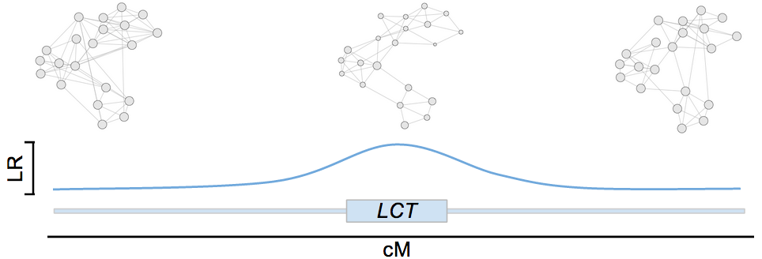


> 1. Topological change to __deviation__ from neutral
> 2. __Not__ all outliers are the same
> 3. __Hypothesis__ typologies

*** =pnotes

1. It is the pattern of covariance that changes not the magnitude of differentiation.
  - potential to reveal additional regions of interest
2. Grouping outliers
3. Scanning based upon external data
4. MUST HAVE EXPECTATIONS FOR WHAT IS ODD


---

Feature     | Trt Means       | P(neu=neg)       | P(neu=pos) 
------------|-----------------|------------------|------------------
Degree      | Pos < Neu < Neg | $0.84$           | __$8.68e^{-13}$__
Node Btwn   | Neu < Neg < Pos | $0.62$           | __$2.09e-4$__
Closeness   | Pos < Neg < Neu | __$1.25e^{-7}$__ | __$5.20e-12$__
cGD         | Neu < Neg < Pos | __$1.45e^{-3}$__ | __$<2.0e-16$__
Edge Btwn   | Neu < Neg < Pos | $0.49$           | __$5.77e-9$__
SlopeDegree | Pos < Neu < Neg | $0.78$           | $0.88$ 
Diameter    | Neu < Neg < Pos | $0.24$           | __$2.06e-9$__


--- &twocol w1:60% w2:40%

## Outliers on Chromosome 2

Simultaneous outliers for all topologically informative parameters.

*** =left

<center>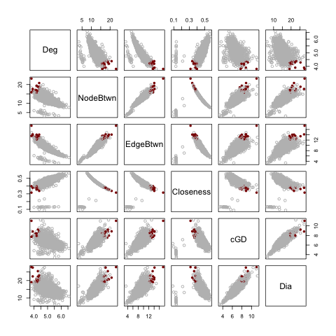</center>

*** =right

&nbsp;

### Identified outliers.

- 17 topologies
&nbsp;

- All previously identified [gdoc](https://docs.google.com/document/d/1rBx09khUDTW7dMEpjS1O_p7j44j5mSrrUW8fOTIfPk4/edit?usp=sharing)
&nbsp;

- Not all the same!


--- 

## Putatively Adaptive Buckets: LCT


$H_O$ Among outliers, what topologies are similar?

&nbsp;


<center>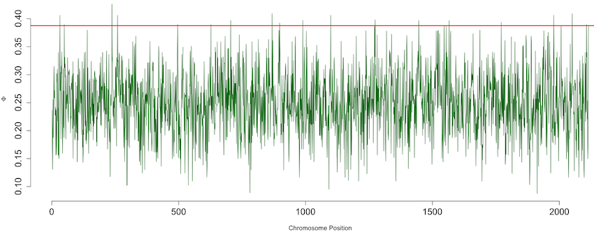</center>


--- bg:white

## Putatively Adaptive Buckets: LCT

&nbsp;


<center>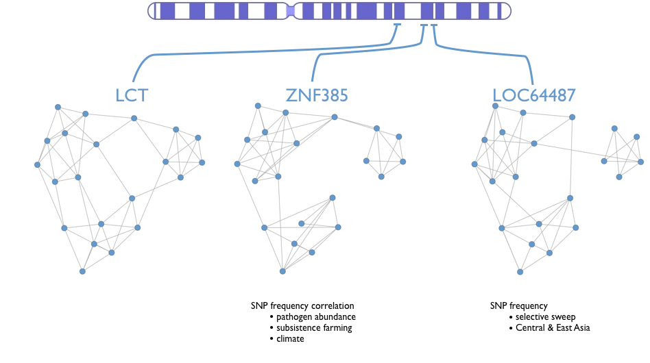</center>


--- 

## Ecologically Motivated Hypothesis Matrix

&nbsp;

What elements of genome covary in a way similar to an ecological variable?

&nbsp;

<center>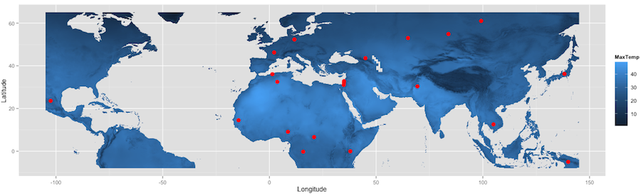</center>


--- 

## Ecologically Motivated Hypothesis Matrix


<center>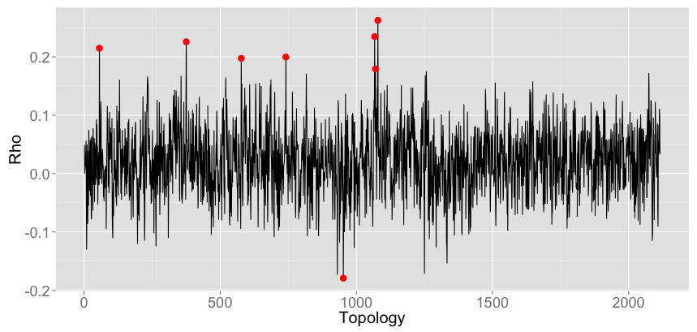</center>

Distance Congruence between maximum local _Temperature_ and inter-population _genetic covariance_ 


--- #genomeBrowser1079 bg:white

<script>
$('#genomeBrowser1079').on('slideenter', function(){
  $(this).find('article')
    .append('<iframe src="http://tinyurl.com/c7go5d2"></iframe>')
});
$('#genomeBrowser1079').on('slideleave', function(){
  $(this).find('iframe').remove();
});
</script>


*** =pnotes
- _EPB41L5:_ Mammalian cell polarity (PMID: 17920587)
- _PTPN4:_ T Cell development & Function (PMID: 18614237)
- _PCDP1:_ Flagellar biogenesis (PMID: 18039845) sinusitis male infertility hydrocephalus citus inversus


--- &twocol

## Utility of Shape-based Approaches

Focusing on the topology of covariance provides complementary insights.

*** =left 
### Neutral Variance

1. $H_O:If$ &nbsp;&nbsp; $\to$ &nbsp;&nbsp; $H_O:How$.

2. Magnitude of structure less relevant.

3. Spatial congruence.


*** =right
### $\;$ &nbsp; &nbsp; $\;$ &nbsp; &nbsp; Adaptive Variance

1. Reduce Type II Error

2.  Negative selection?

3. Internal clustering

4. External hypothese


--- bg:black .nobackground

<center></center>


